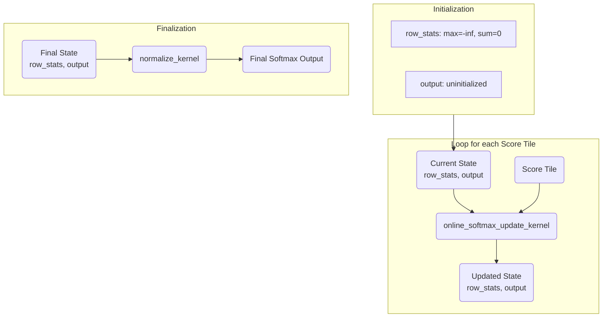

---

> **TL;DR:** This document explains an "online" softmax algorithm, the core of modern fused-attention mechanisms like FlashAttention. It computes softmax tile-by-tile, avoiding the need to store the entire large score matrix in memory.
>
> **View the code: [`kernels/online_softmax.mojo`](kernels/online_softmax.mojo)**

### How to Run

To compile and run this example, first activate the project environment and then execute the Mojo file:

```bash
pixi shell
mojo kernels/online_softmax.mojo
```

---

### Implementation Overview

The attention score matrix `S = QK^T` is often too large for GPU memory. Online softmax, the core of FlashAttention, solves this by processing `S` in tiles without storing the full matrix. This implementation simulates that logic.

The algorithm maintains a running `max` and `sum` for each row, updating them as each tile is processed.

### The Process

The implementation uses an iterative update kernel followed by a final normalization step.

**1. The Update Kernel (`online_softmax_update_kernel`)**

This kernel runs for each new score tile. For each row, it:
1.  **Finds New Max:** Computes the new overall max from the previous max and the current tile's max.
2.  **Rescales Past Results:** If the max changed, it corrects the running sum and all previously written output values using a scale factor `exp(old_max - new_max)`.
3.  **Processes New Tile:** Computes `exp(value - new_max)` for the new tile, adds to the sum, and writes to the output. The updated max and sum are stored for the next iteration.

**2. The Final Normalization Kernel (`normalize_kernel`)**

A final kernel divides each output element by its row's final sum.

### Data Flow Diagram

This diagram shows the iterative nature of the online algorithm.



### Summary of Kernels

| Stage | Kernel | Input Data | Output Data |
| :--- | :--- | :--- | :--- |
| **Initialization** | (Host-side) | - | `row_stats` buffer initialized to `-inf`, `0`. |
| **Update Loop** | `online_softmax_update_kernel` | `scores_tile`, `output` (partial), `row_stats` (old) | `output` (updated), `row_stats` (new) |
| **Finalization** | `normalize_kernel` | `output` (numerators), `row_stats` (denominators) | `output` (final result) |