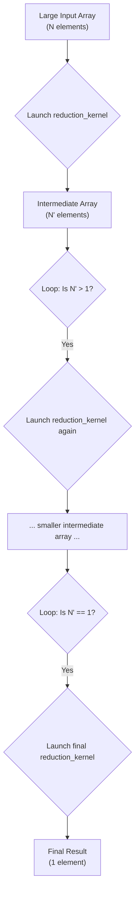

 
---

## TL;DR: `kernels/reduction.mojo`

> **TL;DR:** This document explains a generic, multi-pass parallel reduction algorithm in Mojo. It uses a shared-memory kernel and a host-side loop to efficiently find the sum or maximum of an array of any size.
>
> **View the code: [`kernels/reduction.mojo`](kernels/reduction.mojo)**

---

## A Scalable Parallel Reduction in Mojo

### Goal

To build a reusable GPU function, `reduce`, that can efficiently find the sum or maximum of an array of any size.

### The Algorithm: A Multi-Stage Tournament

The algorithm finds a single result from a large array by running a "tournament" in multiple stages.

1.  **Divide and Conquer:** The initial array is broken into chunks. Many GPU thread blocks work in parallel, each finding the "winner" (the sum or max) of its assigned chunk.
2.  **Combine Results:** The winners from the first round form a new, much smaller array.
3.  **Repeat:** The process repeats, with the array of winners shrinking in each stage, until only one final value remains.

This is achieved with a two-part design:

*   **GPU Kernel (`reduction_kernel`):** The worker. It uses fast on-chip shared memory to efficiently reduce one chunk of data to a single value.
*   **Host Function (`reduce`):** The orchestrator. It runs on the CPU and manages the tournament, repeatedly launching the kernel and handling the intermediate arrays. The diagram below illustrates its logic.

### Implementation Strategy

The implementation uses a hybrid approach to combine performance and safety:

*   **Host-Side (CPU):** The `reduce` function uses raw `UnsafePointer`s to manage the sequence of intermediate buffers. This is necessary because the size of these buffers changes at runtime.
*   **Device-Side (GPU):** The `reduction_kernel` receives the data as a `LayoutTensor`. This provides safe, clear, multi-dimensional array access in the performance-critical code, using a `RuntimeLayout` to handle the dynamic size for each pass.
