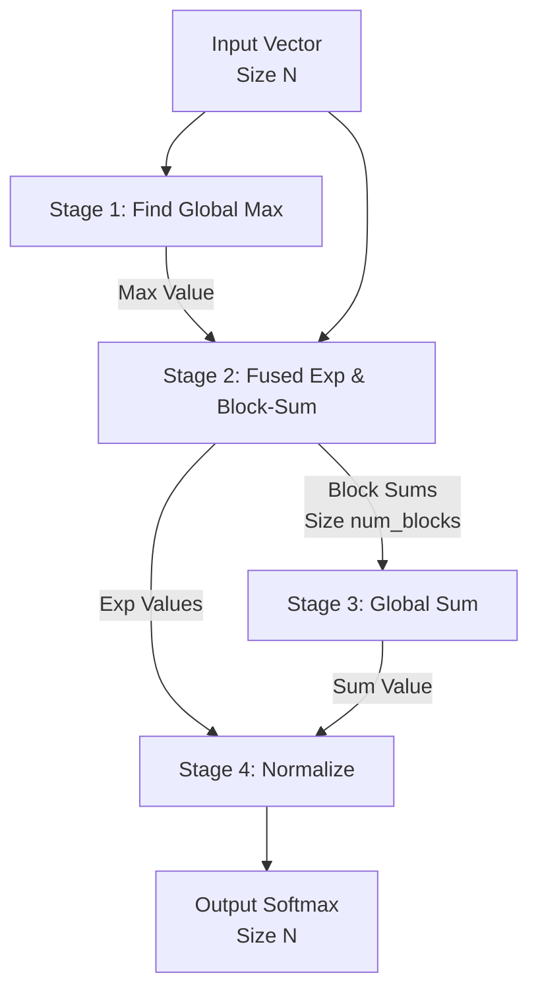

---

> **TL;DR:** This document explains an efficient, multi-stage GPU softmax implementation in Mojo. It uses a generic, multi-pass parallel reduction to handle inputs larger than a single GPU block.
>
> **View the code: [`kernels/softmax.mojo`](kernels/softmax.mojo)**

### How to Run

To compile and run this example, first activate the project environment and then execute the Mojo file:

```bash
pixi shell
mojo kernels/softmax.mojo
```

---

### Implementation Overview

Implementing softmax `σ(z)_i = exp(z_i) / Σ exp(z_j)` efficiently on a GPU is challenging due to two global data dependencies:
1.  **The Global Max:** Needed for numerical stability (`exp(z_i - max(z))`).
2.  **The Global Sum:** Needed for the final normalization.

This implementation uses a 4-stage pipeline built on a generic parallel reduction function to solve this. The reduction uses shared memory for fast intra-block computation and multiple passes for inter-block results.

### The 4-Stage Pipeline

1.  **Find Global Max:** A parallel reduction (`reduce[max_op]`) finds the maximum value of the input vector.

2.  **Fused Exp & Block Sum:** A single, fused kernel computes `exp(x - max)` and calculates partial sums for each block. This fusion saves a full pass over global memory.

3.  **Sum Partial Results:** A second parallel reduction (`reduce[add]`) sums the partial results from the previous stage to get the final denominator.

4.  **Normalize:** A final kernel divides each element by the global sum.

### Data Flow Diagram



### Summary of Data Flow

| Stage | Kernel(s) Used | Input Data | Output Data |
| :--- | :--- | :--- | :--- |
| **1. Find Max** | `reduction_kernel` | `input_tensor` (size N) | `max_buf` (size 1) |
| **2. Exp & Sum** | `exp_and_block_sum_kernel` | `input_tensor`, `max_buf` | `output_tensor` (intermediate), `block_sums_buf` |
| **3. Global Sum** | `reduction_kernel` | `block_sums_buf` | `sum_buf` (size 1) |
| **4. Normalize** | `normalize_kernel` | `output_tensor`, `sum_buf` | `output_tensor` (final result) |