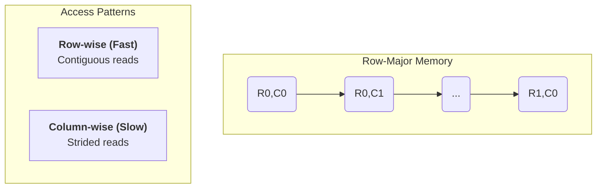
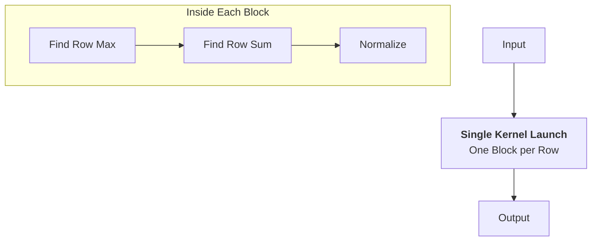
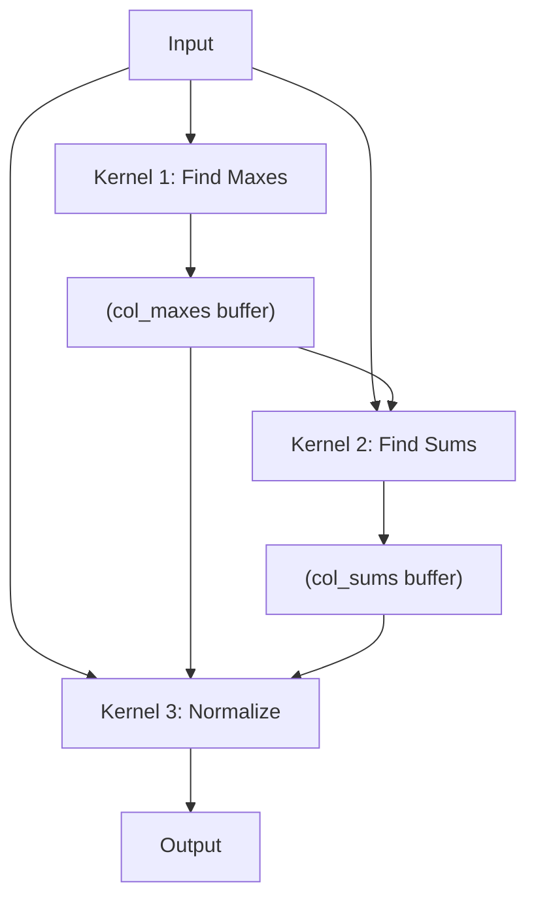

---

## Batched Softmax on the GPU: Row vs. Column

This document compares two strategies for applying softmax to a 2D tensor: **row-wise** and **column-wise**. The choice reveals how memory layout dictates GPU performance.

### The Core Challenge: Memory Access

For a matrix in standard **row-major layout**, accessing elements is not equal.

*   **Row-wise Access:** `[R0,C0], [R0,C1], [R0,C2]...` is **contiguous**. This is fast and ideal for GPUs.
*   **Column-wise Access:** `[R0,C0], [R1,C0], [R2,C0]...` is **strided**. This is slow and inefficient for GPUs.

This difference forces two completely different algorithmic strategies.

---

### 1. Row-Wise Softmax: The Fused Kernel

We can assign **one GPU block per row**. This allows all calculations for a row (max, sum, normalize) to be fused into a **single, efficient kernel launch**.

*   **Strategy:** Single-pass, fused operations.
*   **Performance:** **High**. Maximizes fast, coalesced memory access and minimizes kernel overhead.
*   **Code:** [`batched_row.mojo`](./batched_row.mojo)

---

### 2. Column-Wise Softmax: The Multi-Pass Approach

Because column data is strided, we must use a **multi-pass algorithm**, with each stage being a separate kernel launch.

*   **Strategy:** Three separate kernel passes with intermediate results stored in global memory.
*   **Performance:** **Low**. Suffers from slow, strided memory reads and the overhead of multiple kernel launches.
*   **Code:** [`batched_col.mojo`](./batched_col.mojo)

### Conclusion

| Variant | Strategy | Memory Access | Performance |
| :--- | :--- | :--- | :--- |
| **Row-wise** | Single-Pass, Fused | **Coalesced** | **High** |
| **Column-wise** | Multi-Pass | **Strided** | **Low** |

**Key Takeaway:** Algorithm design on the GPU must respect the memory layout. Aligning computation with contiguous data (row-wise) is dramatically faster than fighting against it (column-wise).